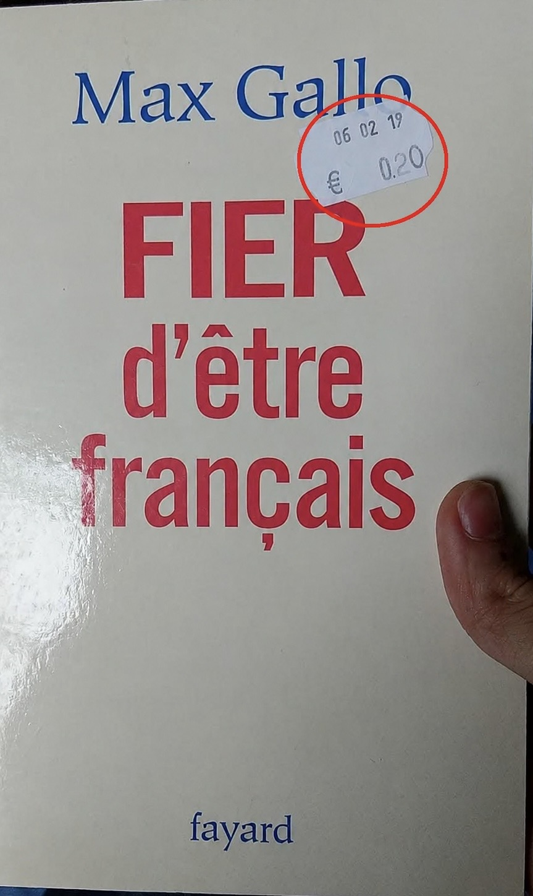

# 欢迎/歡迎/Welcome/<wbr>Välkommen/<wbr>いらっしゃいませ

## About Me

I am a vibe mathematician<strong>vibe mathematician</strong>A mathematician who uses AI instead of the human brain to do mathematics. at the <a href="https://en.igp.ustc.edu.cn/main.htm">Institute of Geometry and Physics</a> in <a href="https://en.wikipedia.org/wiki/Hefei">Hefei</a>. 主业是乳法。

- In 2022, I obtained my PhD degree at <a href="https://www.chalmers.se/sv/Sidor/default.aspx">Chalmers Tekniska Högskola</a> in Sweden<strong>Sweden</strong>A Scandinavian country. It is not Switzerland. under the supervision of Robert Berman.
- Afterwards, I was a <a href="https://kaw.wallenberg.org/en/mingchen-xia">Wallenberg postdoc</a> from 2022 to 2025. In 2023 and 2024 I applied for the <a href="https://www.cnrs.fr/fr/actualite/le-cnrs-lance-avec-mistral-ai-un-outil-dia-generative-securise-mis-disposition-de-ses">CNRS</a><strong>CNRS</strong>An outdated French research institution that prohibits the use of any AI that is actually useful. position twice without getting a single interview.

Email: <xiamingchen2008@gmail.com> 

  <blockquote>
    
Good to know before contacting me: 1. À quelques exceptions près, je refuse de contribuer<strong>contribuer</strong>En tant que    rapporteur et auteur aux revues françaises. 2. My given name is Mingchen instead of Xia, Xiam, Mincheng, Minchen or Mingcheng. And I am male. 3. Preferred languages: Chinese > English or French. Ich versuche, mein Deutsch zu verbessern. Du kannst mir gern auf Hochdeutsch schreiben, wenn es dich nicht stört, Antworten auf holprigem Deutsch zu bekommen.

  </blockquote>
  

[Where I stand on AI and mathematics](ai-and-mathematics.html)

I am interested in machine learning and LLM for the moment.

<section class="content-section content-section--lecture" aria-labelledby="lecture-notes" markdown="1">

## Lecture notes

> Fere libenter homines id quod volunt credunt.

### Archimedean pluripotential theory

- Lectures on pluripotential theory [1](Lectures/ShanghaiTech1.pdf), [2](Lectures/ShanghaiTech2.pdf), [3](Lectures/ShanghaiTech3.pdf), [4](Lectures/ShanghaiTech4.pdf).

> Lecture notes for my course at Shanghai Tech university in the summer of 2023.

- [Characterizations of I-good singularities](Lectures/CAS1.pdf).

> Lecture notes for my course at Chinese academy of science in the summer of 2023.

- [Singularities in global pluripotential theory](Lectures/SGPT_final.pdf). This is (almost) the final version. Nonsense comments in Frenglish are not welcome.

> Lecture notes for my course at Zhejiang university in the spring of 2024. Please let me know if you find any typos/mistakes or find any of the arguments unclear. 

### Non-Archimedean geometry

- Lectures on non-Archimedean pluripotential theory [1](Lectures/USTC_NA_1.pdf), [2](Lectures/USTC_NA_2.pdf), [3](Lectures/USTC_NA_3.pdf), [4](Lectures/USTC_NA_4.pdf).

> Lecture notes for my course at USTC in the spring of 2024.

</section>

## Beamers

- [Pluripotential-theoretic approach to radial energy functionals](Beamers/PTA.pdf)  Beijing university, 11/20/2020 (mm/dd/yyyy).

- [Analytic Bertini theorem](Beamers/ABT.pdf) Oslo SCV conference, 12/18/2021.

- [A mathematician’s complaint about Hermitian operators](Beamers/MC.pdf) A talk for physicists during an informal seminar, 12/10/2021.

- [The volume of pseudo-effective line bundles and partial Okounkov bodies](Beamers/VPPO.pdf)  YMSC Tsinghua university, 12/20/2021.

- [Chern--Weil formulae of singular Hermitian vector bundles](Beamers/CWF.pdf) Aarhus, 05/20/2022.

- [Les singularités $\mathcal{I}$-bonnes --- L'intersection entre la théorie analytique et la théorie algébrique](Beamers/IBS.pdf) IMJ-PRG, 01/03/2023.

> En attendant le remboursement du repa de 7 euros jusqu'à aujourd'hui.

- [A transcendental approach to non-Archimedean metrics](Beamers/TAnA.pdf) Göteborg, 05/04/2023.

- [Transcendental Okounkov bodies and the trace operator of currents](Beamers/TOB.pdf) Toulouse, 10/05/2023.

- [Singularities in global pluripotential theory](Beamers/SGPT.pdf) Kanazawa, 12/06/2023.

- [Partial Okounkov bodies and toric geometry](Beamers/POB.pdf) Cambridge, 05/17/2024.

- [A brief history of potential theory — From Poisson to Lelong](Beamers/HPT.pdf) Shanghai, 09/04/2024

- [Transcendental b-divisors](Beamers/TBD.pdf) Göteborg, 05/28/2025.

- [Zero-mass conjecture --- AI-assisted counterexample](Beamers/ZMC.pdf) Harbin, 08/14/2026.

<section class="content-section content-section--research" aria-labelledby="research" markdown="1">

## Research

>Errare humanum est.

All my preprints can be found on arXiv. See [my Google Scholar page](https://scholar.google.se/citations?user=1GbYhEMAAAAJ) as well. All my mathematical works starting from July 2026 rely on AI.

I am glad to spend my extra tokens on helping the other mathematicians (French excluded). Feel free to contact me!

### Works in progress

- [Mixed volumes of Okounkov bodies](Papers/MVOB.pdf)

> Updated in July 2026. I proved the mixed volume formula of Okounkov bodies and partial Okounkov bodies.

- [Analytic Bertini Theorem II --- The local case](Papers/ABT2.pdf)

> Updated in July 2026. I completely solved the local version of the analytic Bertini theorem.

- [Transcendental b-divisors](Papers/TB.pdf)

> Updated in December 2025.

- [Transcendental b-divisors II](Papers/TB2.pdf)

> Updated in July 2026. The optimal constant in Corollary 6.17 is obtained.

 I'm working on a third part of this series, where I seek to define a new Monge--Ampère measure compatible with Cao's mixed volume.

### Vibe math

The articles in this section are generated by AI. I have not carefully verified every detail.

- [NUMA vibe](Papers/NUMA_vibe.pdf)

### K-stability

- On sharp lower bounds for Calabi type functionals and destabilizing properties of gradient flows, ***Analysis & PDE***, (2021).  [arXiv:1901.07889](https://arxiv.org/abs/1901.07889) [Journal link](https://msp.org/apde/2021/14-6/p12.xhtml)

> My note [Radial Calabi flow](Notes/RCF.pdf) might be of interest to the readers of this paper.

- Pluripotential-theoretic stability thresholds, ***IMRN***, (2022).  [arXiv:2012.12039](https://arxiv.org/abs/2012.12039) [Journal link](https://academic.oup.com/imrn/advance-article-abstract/doi/10.1093/imrn/rnac186/6644735)

> In arXiv version 1, Section 8, I briefly explained the second order expansion of Donaldson's L-functionals, which might be of interest as well.

### Pluripotential theory

- Integration by parts formula for non-pluripolar product.  [arXiv:1907.06359](https://arxiv.org/abs/1907.06359)

> This paper was the first proof of the integration by parts formula. However, a better approach was found later on by Lu, so this paper is no longer important. I don't intend to submit it.

- Mabuchi geometry of big cohomology classes with prescribed singularities, ***Journal für die reine und angewandte Mathematik***, (2023). [arXiv:1907.07234](https://arxiv.org/abs/1907.07234) [Journal link](https://www.degruyter.com/document/doi/10.1515/crelle-2023-0019/html)

>  There is a slight issue in the proof of Theorem 2.11 line 10:  $f^{\#}$ is only formally smooth, not smooth.  This does not affect anything in the proof. This is corrected in [this version](Papers/MG.pdf).

> As pointed out by Vasanth Pidaparthy and Prakhar Gupta, the statement of Proposition 4.12(ii) (Proposition 6.12(ii) in the arXiv version) is wrong in the generality as stated there,  one needs to assume that $\varphi_0\leq \gamma\leq \varphi_1$ in addition. This mistake does not affect the other parts of the paper.

> The published version contains only the special case without prescribed singularities on Kähler manifolds. The method in the general case is exactly the same.

- The closures of test configurations and algebraic singularity types, (joint with Tamás Darvas), ***Advances in Mathematics***, (2022).  [arXiv:2003.04818](https://arxiv.org/abs/2003.04818) [Journal link](https://www.sciencedirect.com/science/article/pii/S0001870822000147)

- The volume of pseudoeffective line bundles and partial equilibrium, (joint with Tamás Darvas), ***Geometry & Topology***, (2024). [arXiv:2112.03827](https://arxiv.org/abs/2112.03827) [Journal link](https://msp.org/gt/2024/28-4/p09.xhtml)

- Partial Okounkov bodies and Duistermaat--Heckman measures of non-Archimedean metrics. [arXiv:2112.04290](https://arxiv.org/abs/2112.04290)

> The proof of the Hausdorff convergence property in this paper is quite messy. My [book](Lectures/SGPT2.pdf) contains a more readable proof.

- Non-pluripolar products on vector bundles and Chern--Weil formulae, ***Mathematische Annalen***, (2024). [arXiv:2210.15342](https://arxiv.org/abs/2210.15342) [Journal link](https://link.springer.com/article/10.1007/s00208-024-02838-4)

- Transcendental Okounkov bodies, (joint with Tamás Darvas, Rémi Reboulet, David Witt Nyström and Kewei Zhang). [arXiv:2309.07584](https://arxiv.org/abs/2309.07584)

- The trace operator of quasi-plurisubharmonic functions on compact Kähler manifolds, (joint with Tamás Darvas). [arXiv:2403.08259](https://arxiv.org/abs/2403.08259)

- A counterexample to the zero-mass conjecture, (joint with Long Li). [arXiv:2607.26549](https://arxiv.org/abs/2607.26549)

### Non-Archimedean geometry and algebraic geometry

- On Liu morphisms in non-Archimedean geometry, ***Israel Journal of Mathematics, (2022)***. [arXiv:2106.08032](https://arxiv.org/abs/2106.08032) [Journal link](https://link.springer.com/article/10.1007/s11856-022-2456-6)

> In the complex analytic setting, very similar arguments (using Fréchet algebras instead of Banach algebras) give the notion of Stein morphisms. It is of interest to see if these morphisms are useful.  M. Maculan pointed out that Liu morphisms are not G-local on the target, see the [corrected version](Papers/Liu.pdf).  I will update arXiv in a few days.

- Analytic Bertini theorem, ***Mathematische Zeitschrift***, (2022).  [arXiv:2110.14971](https://arxiv.org/abs/2110.14971) [Journal link](https://link.springer.com/article/10.1007/s00209-022-03103-7)

>  There is minor gap in the proof:  In the first step, one needs to further enlarge $\Sigma_1$ to make sure that the restriction ideal coincides with the pull-back as coherent sheaves. A corrected proof is presented in my lecture notes at Zhejiang University. 

- A transcendental approach to non-Archimedean metrics of pseudoeffective classes, (joint with Tamás Darvas and Kewei Zhang). [arXiv:2302.02541](https://arxiv.org/abs/2302.02541)

> The theory of non-Archimedean psh functions we developed in this paper trivally satisfies Boucksom--Jonsson's envelope conjecture (even on a general unibranch complex space), see my note [Operations on transcendental non-Archimedean metrics](Notes/OTNA.pdf).

</section>

<section class="content-section content-section--notes" aria-labelledby="some-notes" markdown="1">

## Some notes

- [LaTeX tips for working mathematicians](Notes/LaTeX_tips.pdf)

- [Relative pluripotential theory](Notes/RPT.pdf) (Chapter I to Chapter III)

> Just a preliminary version with potentially many mistakes. I'm slowly adding new materials.

- [Radial Calabi flow](Notes/RCF.pdf)  

> One of my unfinished projects. It contains a number of conjectures of interest.

- [Note on relative normalisations](Notes/RN.pdf)

> I collect a few well-known results about relative normalisations.

- Notes on the toroidal compactifications of Shimura varieties: [I](Notes/SV1.pdf), [II](Notes/SV2.pdf), [III](Notes/SV3.pdf), [X](Notes/SV10.pdf), [XIII](Notes/SV13.pdf).

- Notes on Hodge theory: [Carlson's correspondence](Notes/Hodge1.pdf).

- [Operations on transcendental non-Archimedean metrics](https://bookstore.ams.org/view?ProductCode=CONM/810). [arXiv:2312.17150](https://arxiv.org/abs/2312.17150).

> This note is a trivial continuation of my joint paper with Darvas and Zhang. The only notable result is Theorem 4.21.  The editors put an earlier version in the final book by mistake. Please read the arXiv version instead. 

- [Non-pluripolar currents are not necessarily I-good](Notes/IGE.pdf)

> I construct a non-pluripolar qpsh function with small unbounded locus which is not I-good.

- Notes on Ducros' book "La structure des courbes analytiques" [Chapter 3](Notes/Duc3.pdf), [Chapter 4](Notes/Duc4.pdf)

> My notes while learning Ducros' book.

- [A proof of Satz von H. Cartan](Notes/SC.pdf)

> I give a proof of Cartan's theorem about closed ideals in Stein algebras. This is a well-known result, but I cannot find the proof anywhere.

- [Stein spaces](Notes/SS.pdf)

> My personal notes about the theory of Stein spaces. The 1976 paper of Bingener is integrated into these notes.

- [Schemata über Steinschen Algebren](LaTeX/Bingener.pdf)

> I turn Bingener's famous 1976 paper in to LaTeX format. 

- [Analytic singularities are not birationally invariant](Notes/AS_Bir.pdf)

</section>

## My favourite links

### Legal links

- [Online math seminars](https://researchseminars.org)

- [Tikz-cd editor](https://tikzcd.yichuanshen.de)

- [Quiver](https://q.uiver.app)

- [Stacks Project](https://stacks.math.columbia.edu)

- [Kerodon](https://kerodon.net)

- [Almost Sure](https://almostsuremath.com)

- [MacTutor](https://mathshistory.st-andrews.ac.uk)

### Illegal links

- [ZLibrary](https://z-library.sk)

> Updated on Nov 8, 2024.

- [Libgen](https://libgen.vg)

> Updated on Jul 21, 2025.

- [Sci-hub](http://sci-hub.vkif.top)

> Sci-hub is getting blocked in many countries recently. If the link fails to work, please try to change the domain name.
