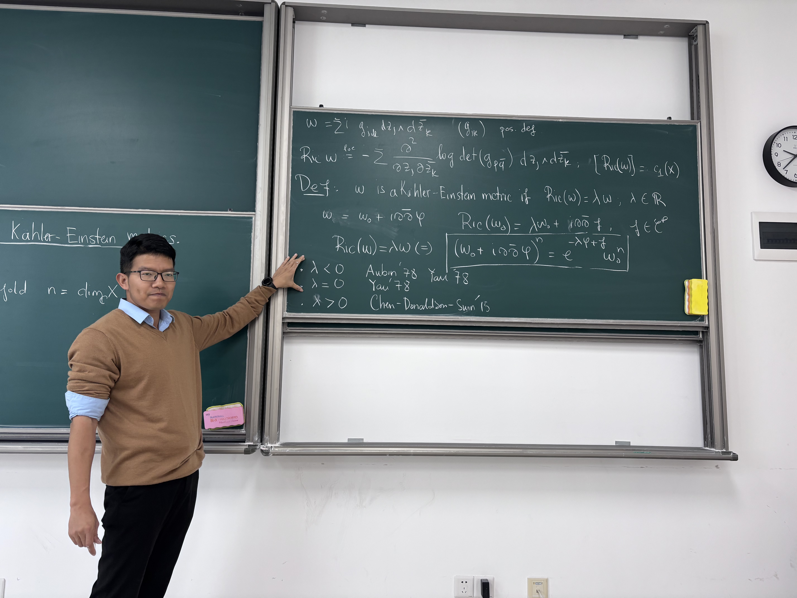
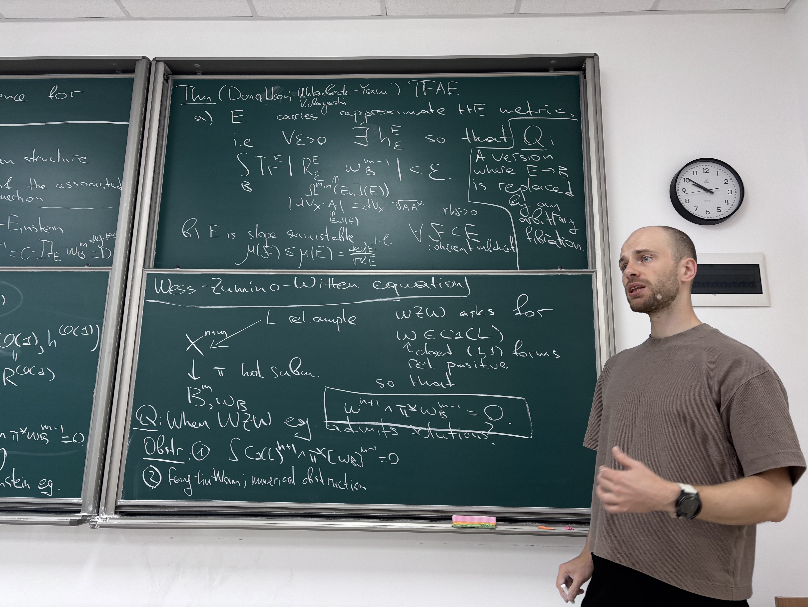
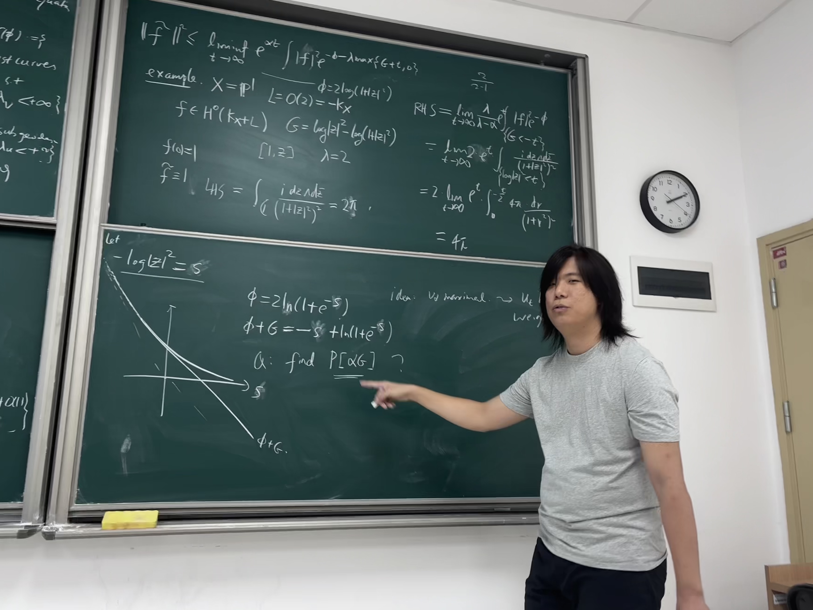
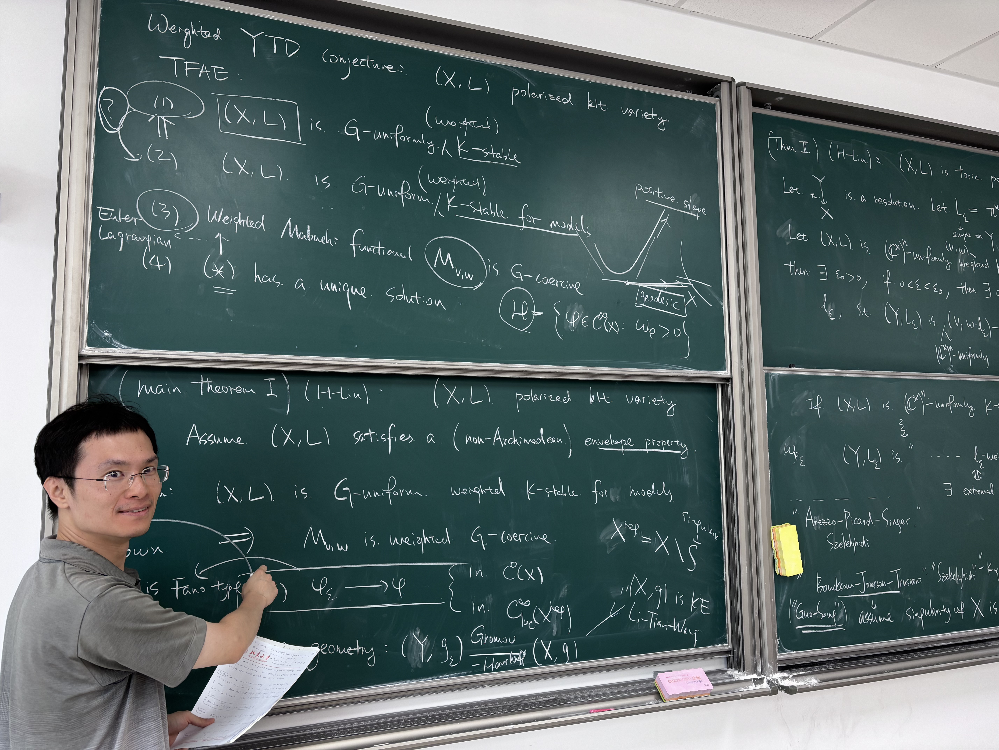
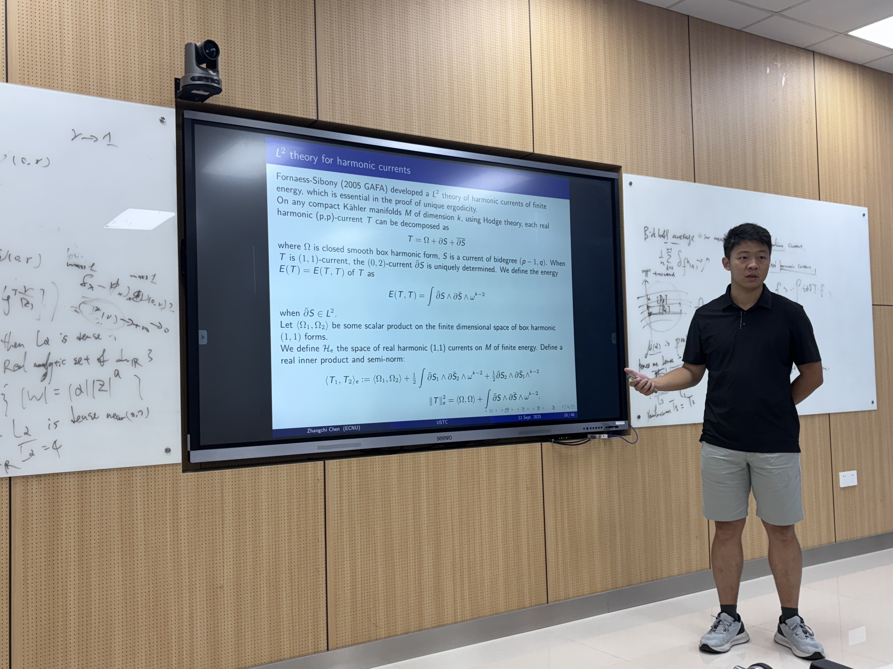

# USTC complex geometry seminar

This is the homepage of a complex geometry seminar organized by [Mingchen Xia](readme.md) at USTC, Hefei. Unless otherwise specified, all talks take place in Room 1124, Material Science Research Building (Section C).

If you wish to visit USTC and give a talk, please contact Mingchen. Anyone who has never worked in the French government is welcome.

## Forthcoming talks

Speaker: [Virgile Tapiero](https://vtapiero.pages.math.cnrs.fr), IMFP

Title: Normal forms and Lyapunov exponents of endomorphisms of the complex projective plane

Time: Nov. 13, 2025 (Thursday) 10:00~11:00

> Abstract: Let f be an endomorphism of the complex projective plane P^2 of degree d>1. There exists a unique probability measure μ of maximal entropy (equal to log d^2) for f. It is ergodic and admits Lyapunov exponents L_1 ≥ L_2. A fundamental result due to J.-Y. Briend and J. Duval (1999) states that the Lyapunov exponents of μ are bounded below by a constant depending only on the degree d of f, more precisely, they are bounded below by (log d)/2. The case of equality L_1 = L_2 = (log d)/2 was characterized by several authors, who showed that this happens if and only if μ is absolutely continuous with respect to the Lebesgue measure.
>
> μ is also a Monge-Ampère mass: μ = T ∧ T the autointersection of the Green current T of f. R. Dujardin proved (2012) that μ << Trace(T) implies L_2 = (log d)/2. He also addressed the question of the reverse property. In this talk, we will focus on the case L_1 > L_2 = (log d)/2. I will explain how to prove that L_2 = (log d)/2 implies μ << Trace(T), answering Dujardin’s question. The techniques involved are based on pluripotential theory, ergodic theory, and the use of normal forms for the dynamics.

---

Speaker: [Genglong Lin](https://www.bimsa.cn/detail/GenglongLin.html), BIMSA

Title: Degenerate Hessian type equations on compact Hermitian manifolds

Time: Nov. 28, 2025 (Friday) 10:00~11:00

> Abstract: In this talk we will discuss my recent progress on a class of degenerate Monge--Ampère equations in a nef class on compact Hermitian manifolds. The method combines with a series work of Darvas--Di Nezza--Lu.  Secondly, we will talk about the finite energy range of Hessian equations on compact Kähler manifold. The proof is different from Darvas--Di Nezza--Lu’s. Partially based on joint work with Yinji Li and Xiangyu Zhou.

---

Speaker: [Ying Wang](https://ywangx.github.io/home/), University of Michigan

Title: Non-Archimedean Calabi--Yau potentials on certain affine varieties

Time: Dec. 18, 2025 (Thursday) 10:00~11:00

> We solve a non-Archimedean Monge-Ampère equation on the Berkovich analytification of a complex log Calabi-Yau pair whose dual complex is a standard simplex, answering a question of Collins-Li and offering a non-Archimedean analog of Ricci-flat metric potentials on complex affine varieties. This work builds on the solution to a complex Monge--Ampère equation obtained by Collins--Li and Collins--Tong--Yau.
>
> We also show the suitably rescaled limits of the complex potentials coincide with their non-Archimedean counterparts in some situations, strengthening their connections.

---

Speaker: [Trung Nghiem](https://sites.google.com/view/trung-nghiem), Université Claude Bernard Lyon 1

Title: An effective construction of asymptotically conical Calabi--Yau metrics

Time: TBA

> An asymptotically conical Calabi--Yau manifold is a Ricci-flat Kähler manifold whose shape, when zoomed out towards infinity, looks like a Calabi--Yau cone. A recent work of Conlon--Hein shows that an AC Calabi--Yau manifold is obtained either by algebraic deformations or crepant resolution in a reversible and exhaustive process. In terms of the metric on the cone, the behavior of the AC Calabi--Yau metric is said to be quasi-regular or irregular. Examples of the latter are notoriously rare in the literature: in fact the only such example before our work was built by Conlon--Hein using ad-hoc computations; but there had been no explicit way to obtain them, and an open question in their paper was whether there exist more metrics of the same kind. In my talk, I'll present an effective strategy to construct new irregular AC Calabi--Yau manifolds via Altmann's deformation theory of isolated toric Calabi--Yau cones. This is a joint work with Ronan Conlon (University of Texas, Dallas).

## Past talks

Speaker: [Quang-Tuan Dang](https://quangtuandang.github.io/Webpage/), Tsinghua University

Title: Degeneration of conic Kähler--Einstein metrics in big classes

Time: Nov. 5, 2025 (Wednesday) 9:30~10:30

> Abstract: Let X be a compact Kähler manifold and D a simple normal crossing divisor on $X$ such that K_X+D is merely big. I will present a recent joint work with Duc-Viet Vu in which we establish the weak convergence of conical Kähler--Einstein metrics of negative curvature to a singular Kähler-Einstein metric in the class c_1(K_X+D). This partially answers a question posed by Biquard and Guenancia.

 

---

Speaker: [Yi Yao](https://grzy.hnu.edu.cn/mobile/m_index/yaoyi), Hunan University

Title: Maximal destabilizers for Chow and K-stability

Time: Oct. 30, 2025 (Thursday)  10:40~11:30

> Abstract: When Kahler manifold (X, L) admits cscK metrics, Donaldson uses the balanced metrics to quantize the cscK metrics. In the opposite case, if (X, L) is K-unstable, then the Kodaira embedding of X via \|kL\| would be Chow-unstable when k is large enough. In this case, we have a maximal K-destabilizer due to Xia and Li, and a sequence of maximal Chow-destabilizers due to Kempf. A natural question is whether the latter will converge to the former in a certain sense. We propose a variational approach based on Boucksom-Jonsson’s non-Archimedean pluripotential theory. We shall start with the toric setting, where things become very concrete.

 

---

Speaker: [Siarhei Finski](https://finski.info), École Polytechnique

Title: Kobayashi--Hitchin correspondence for polarized fibrations

Time: Oct. 30, 2025 (Thursday) 9:30~10:20  

> Abstract: A Hermitian metric on a holomorphic vector bundle is said to be Hermite-Einstein if its mean curvature is proportional to the identity operator. The Kobayashi-Hitchin correspondence (or the Donaldson-Uhlenbeck-Yau theorem) asserts that a holomorphic vector bundle admits a Hermite-Einstein metric if and only if it satisfies the algebraic condition of slope polystability.
>
> In this talk, I will describe a recent extension of the Kobayashi-Hitchin correspondence to general fibrations beyond holomorphic vector bundles. Specifically, for a polarized family of complex projective manifolds, we examine the so-called Wess-Zumino-Witten (WZW) equation, which specializes to the Hermite-Einstein equation, when the polarized fibration is associated with a projectivization of a holomorphic vector bundle. We establish that the existence of approximate solutions to this equation is equivalent to the asymptotic semistability of the direct image sheaves associated with high tensor powers of the polarizing line bundle.

 

---

Speaker: Yan He, Norwegian University of Science and Technology (NTNU)

Title: Ross--Witt Nyström Correspondence and Ohsawa--Takegoshi extension theorem

Time: Oct. 16, 2025 (Thursday)  13:30~14:30

> Abstract: In this talk, I introduce the correspondence between analytic test curves and the geodesic rays in the space of Kähler potentials by Legendre transform and how this gives a better L2 estimate in the Ohsawa--Takegoshi theorem.

 

---

Speaker: [Jiyuan Han](https://its.westlake.edu.cn/info/1108/1277.htm), Westlake University

Title: On the existence of weighted-cscK metrics

Time: Oct. 10, 2025 (Friday)  10:00~11:00

> Abstract: Weight-cscK metrics provide a universal framework for the study of canonical metrics, e.g, extremal metrics, Kähler Ricci soliton metrics, µ-cscK metrics. In joint works with Yaxiong Liu, we prove that on a Kahler manifold X, the G-coercivity of weighted Mabuchi functional implies the existence of weighted-cscK metrics.  In particular, there exists a weighted-cscK metric if X is a projective manifold that is weighted K-stable for models.  We will also discuss some progress on singular varieties.

 

---

Speaker: [Zhiwei Wang](http://math0.bnu.edu.cn/~wangzw/), Beijing Normal University

Title: Recent progress on the SOS conjecture

Time: Sep. 19, 2025 (Friday) 10:00~11:00 

> Abstract: In this talk, we will introduce our recent progress on the study of the SOS conjecture (proposed by Ebenfelt), which is closely related to the Huang-Ji-Yin gap conjecture in the study of rational proper maps between the complex unit balls. This is based on joint work with Chenlong Yue and Professor Xiangyu Zhou.

 
---

Speaker: [Zhangchi Chen](https://math.ecnu.edu.cn/en/facultydetailen.html?uid=zcchen), East China Normal University

Title: Around the unique ergodicity of holomorphic foliations

Time: Sep. 11, 2025 (Thursday) 10:00~11:00 

> Abstract: Holomorphic foliations are geometric structures to foliate high dimensional complex manifolds with low dimensional ones (called leaves). The key problem in this area is to study the density and the distribution of leaves. Fornaess-Dinh-Nguyen-Sibony proved that in compact Kahler surfaces, foliations with only hyperbolic singularities admits unique ergodicity. In particular, if the foliation does not direct any positive closed currents, then there is a unique (up to scaling) positive harmonic current directed by it. As a consequence, each leaf is dense and has the same distribution in the sense of Nevanlinna currents.
In this talk I will introduce the basic concepts about holomorphic foliations, hyperbolic singularities, harmonic currents. I will review the unique ergodicity, and talk about my result on the Lelong number of directed harmonic currents. Finally, I will talk about some open problems.

 
---
